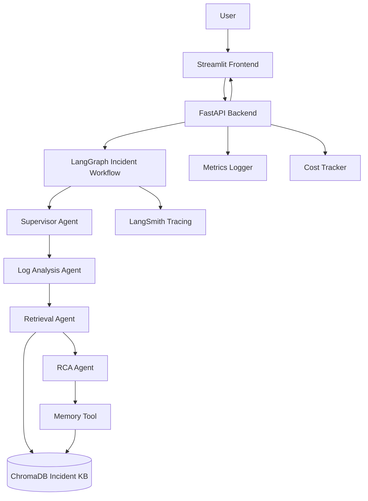
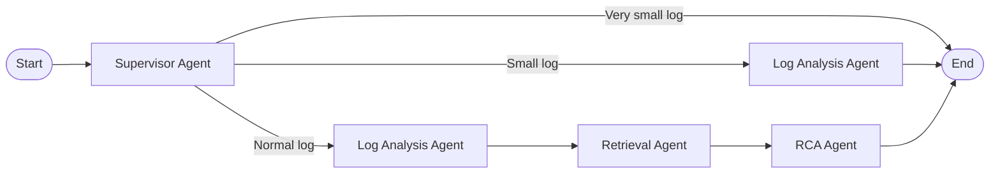
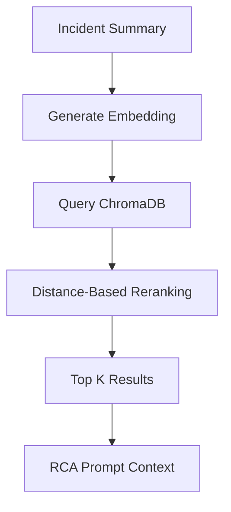
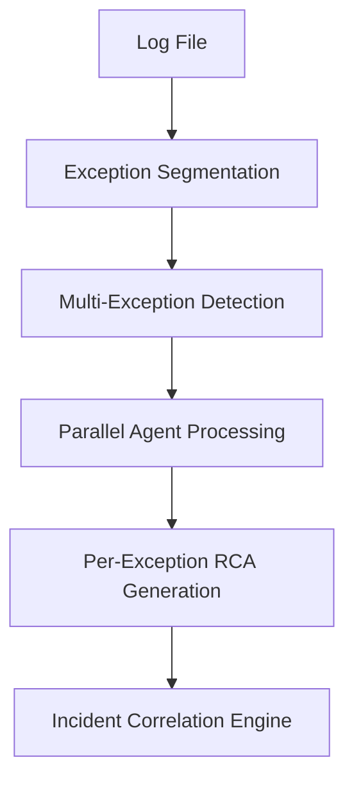
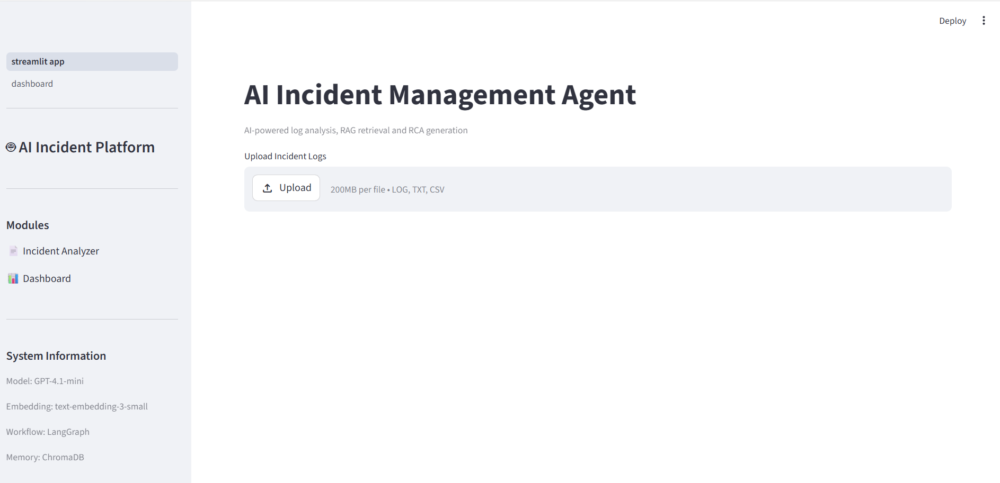
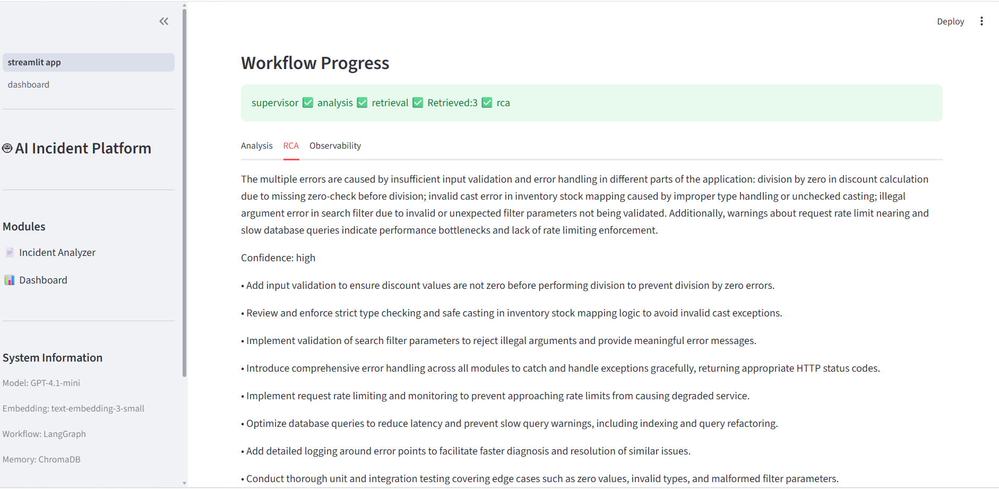
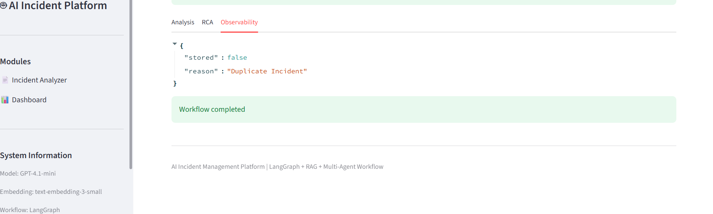
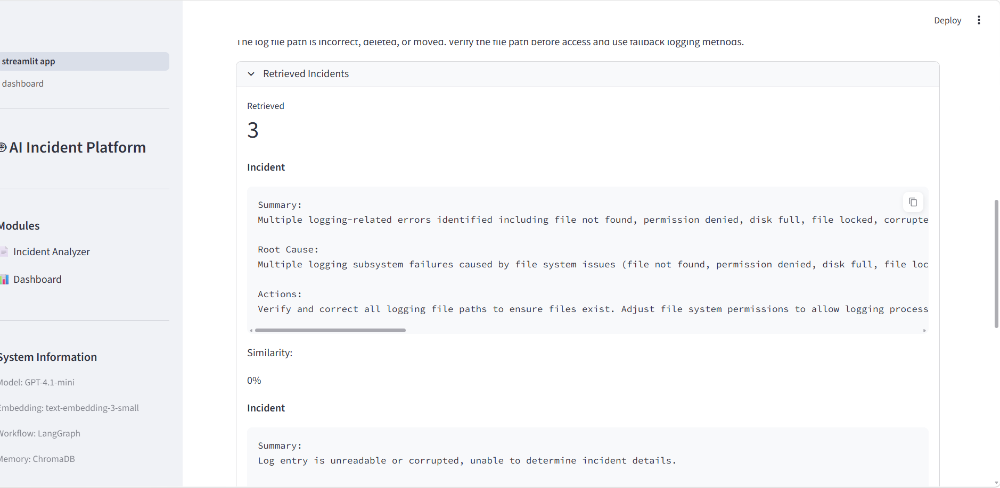
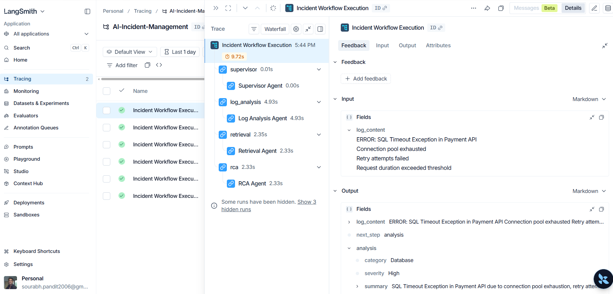

# AI Incident Management Platform - Project Documentation

## 1. Project Overview

The AI Incident Management Platform is an AI-powered application for analyzing incident logs, identifying incident category and severity, retrieving similar historical incidents, generating root cause analysis (RCA), and recommending remediation actions.

The platform uses a FastAPI backend, Streamlit frontend, LangGraph-based agent orchestration, OpenAI models, ChromaDB vector storage, and LangSmith tracing.

## 2. Problem Statement

Incident response teams often spend significant time reading raw log files, identifying the dominant failure pattern, searching for similar past incidents, and preparing root cause analysis. This manual process can delay remediation and create inconsistent incident documentation.

This project addresses that gap by automating the first-pass analysis of uploaded incident logs and enriching the analysis with historical incident context.

## 3. Business Use Case

The platform supports SRE, DevOps, application support, and incident management teams that need faster triage during production incidents.

Business benefits include:

* Reduced mean time to identify likely root cause
* Faster incident triage and escalation
* Reuse of historical incident knowledge
* Consistent RCA and remediation output
* Better visibility into workflow execution, cost, and memory updates

## 4. Objectives

* Accept uploaded log files through a simple UI
* Validate and limit input before sending it into the AI workflow
* Categorize the incident and estimate severity
* Retrieve similar historical incidents using semantic search
* Generate structured RCA and recommended remediation actions
* Track execution metrics, token usage, estimated cost, and workflow path
* Store useful incident knowledge for future retrieval
* Provide observability through dashboard and LangSmith tracing

## 5. Functional Flow

1. User uploads a `.log`, `.txt`, or `.csv` file from the Streamlit frontend.
2. Frontend validates file size using `MAX_FILE_SIZE_MB`.
3. Frontend sends the file to the FastAPI `/analyze` endpoint.
4. Backend reads and validates the log content using input guardrails.
5. Backend limits log content using `MAX_LOG_SIZE`.
6. LangGraph workflow starts with the Supervisor Agent.
7. Supervisor routes the request based on log size.
8. Log Analysis Agent generates category, severity, and summary.
9. Retrieval Agent searches ChromaDB for similar historical incidents.
10. RCA Agent generates root cause, confidence, and recommended actions.
11. Memory tool stores incident knowledge when applicable.
12. Backend calculates execution time, token usage, and estimated cost.
13. Frontend displays analysis, RCA, retrieved incidents, workflow path, and observability details.

## 6. Architecture Diagram



## 7. Tech Stack

| Layer | Technology |
| --- | --- |
| Frontend | Streamlit |
| Backend API | FastAPI |
| Agent Orchestration | LangGraph |
| LLM | OpenAI `gpt-4.1-mini` |
| Embeddings | OpenAI `text-embedding-3-small` |
| Vector Store | ChromaDB |
| Tracing | LangSmith |
| Metrics Storage | JSON file in `data/execution_history.json` |
| Containerization | Docker and Docker Compose |
| Language | Python |

## 8. Agent Workflow



Agent responsibilities:

* Supervisor Agent: Determines whether to end, run analysis only, or run the full workflow.
* Log Analysis Agent: Produces incident category, severity, and summary from uploaded logs.
* Retrieval Agent: Uses the incident summary to retrieve similar incidents from ChromaDB.
* RCA Agent: Uses current incident summary and retrieved history to generate RCA.
* Memory Tool: Stores useful incident summary, root cause, and actions when unique.

## 9. RAG Design

The Retrieval-Augmented Generation design improves RCA quality by providing the RCA Agent with similar historical incidents.

RAG flow:



Design details:

* Embedding model: `text-embedding-3-small`
* Vector database: local persistent ChromaDB at `./chroma_db`
* Collection name: `incident_kb`
* Retrieval count: configured through `TOP_K_RESULTS`
* Similarity confidence: calculated from vector distance as a percentage
* Current reranking: simple distance-based sorting

## 10. Features

* Log file upload
* Incident categorization
* Severity prediction
* Structured incident summary
* Similar incident retrieval with RAG
* Root cause analysis generation
* Recommended remediation actions
* Multi-agent workflow orchestration
* Supervisor-based workflow routing
* Input guardrails for log size, recognizable log content, excessive special characters, and suspicious payload patterns
* Workflow safety wrapper
* Retry handling for agent/tool failures
* Token usage and estimated cost calculation
* Execution metrics logging
* Retrieval confidence scoring
* Memory persistence for incident knowledge
* Streamlit observability dashboard
* LangSmith tracing support
* Dockerized backend and frontend

## 11. Folder Structure

```text
ai-incident-management/
├── backend/
│   ├── agents/
│   │   ├── log_analysis_agent.py
│   │   └── rca_agent.py
│   ├── config/
│   │   └── settings.py
│   ├── guardrails/
│   │   ├── input_validator.py
│   │   └── workflow_guard.py
│   ├── memory/
│   │   └── incident_memory.py
│   ├── prompts/
│   │   ├── log_analysis_prompt.py
│   │   ├── rca_prompt.py
│   │   └── supervisor_prompt.py
│   ├── rag/
│   │   ├── chroma_store.py
│   │   ├── load_incidents.py
│   │   └── retrieval.py
│   ├── tools/
│   │   ├── agent_tools.py
│   │   ├── cost_tracker.py
│   │   ├── metrics_logger.py
│   │   ├── openai_service.py
│   │   └── retry_handler.py
│   ├── workflows/
│   │   ├── incident_workflow.py
│   │   ├── nodes.py
│   │   ├── state.py
│   │   └── supervisor_node.py
│   ├── Dockerfile
│   └── main.py
├── frontend/
│   ├── pages/
│   │   └── dashboard.py
│   ├── Dockerfile
│   └── streamlit_app.py
├── data/
│   ├── execution_history.json
│   └── incidents.json
├── chroma_db/
├── scripts/
│   ├── run_backend.ps1
│   └── run_frontend.ps1
├── ARCHITECTURE_DECISIONS.md
├── README.md
├── docker-compose.yml
├── PROJECT_DOCUMENTATION.md
└── requirements.txt
```

## 12. Setup Steps

Create and activate a virtual environment:

```powershell
python -m venv venv
venv\Scripts\activate
```

Install dependencies:

```powershell
pip install -r requirements.txt
```

Create a `.env` file:

```env
OPENAI_API_KEY=
LANGSMITH_API_KEY=
LANGCHAIN_TRACING_V2=true
LANGCHAIN_PROJECT=
```

Load or refresh historical incidents in ChromaDB if needed:

```powershell
python backend/rag/load_incidents.py
```

Run the backend:

```powershell
uvicorn backend.main:app --reload
```

Backend API documentation:

```text
http://127.0.0.1:8000/docs
```

Run the frontend:

```powershell
python -m streamlit run frontend/streamlit_app.py
```

Frontend URL:

```text
http://localhost:8501
```

Run the observability dashboard from the Streamlit sidebar or directly:

```powershell
python -m streamlit run frontend/pages/dashboard.py
```

## 13. Docker Setup

Build containers:

```powershell
docker compose build
```

Run backend and frontend:

```powershell
docker compose up
```

Service URLs:

| Service | URL |
| --- | --- |
| Backend | `http://127.0.0.1:8000` |
| Backend Docs | `http://127.0.0.1:8000/docs` |
| Frontend | `http://localhost:8501` |

## 14. Limitations

* Current processing is optimized for one dominant incident pattern per uploaded log.
* Multiple independent exceptions in the same file may be blended into a consolidated RCA.
* Large logs are limited by `MAX_LOG_SIZE`, so some context may be excluded.
* Input guardrails reject very small content, non-log-like content, excessive special characters, and suspicious payload patterns before workflow execution.
* Current RAG retrieval uses simple distance-based reranking.
* ChromaDB is configured as a lightweight local vector store for POC/demo usage.
* Streamlit is fast for prototyping but less flexible than a full frontend framework.
* RCA quality depends on log quality, prompt quality, and the relevance of retrieved incidents.
* File size is limited by `MAX_FILE_SIZE_MB`.
* Production authentication, authorization, and enterprise-grade persistence are not currently implemented.

## 15. Future Enhancements

* Multi-Incident Intelligence Engine
* Exception segmentation
* Multi-exception detection
* Parallel agent processing
* Per-exception RCA generation
* Incident correlation engine
* Chunking and chunk summarization for large logs
* Advanced reranking or cross-encoder reranking
* Redis or managed memory backend
* Cloud deployment
* Production authentication and authorization
* Stronger observability and alerting integrations
* Automated evaluation for analysis and RCA quality

Future target flow:



## 16. Screenshots

Screenshots can be added after running the application locally.

### Frontend upload screen



### Analysis result tab


### RCA result tab



### Observability tab



### Dashboard page


### FastAPI Swagger docs



### LangSmith trace view




## 17. Conclusion

The AI Incident Management Platform demonstrates how LLMs, RAG, and multi-agent workflow orchestration can accelerate incident triage. It provides a practical foundation for automated log analysis, historical incident retrieval, RCA generation, observability, and future multi-incident intelligence.

The current implementation is suitable for POC and demo scenarios focused on a primary incident pattern, with a clear roadmap toward more advanced multi-exception processing and production readiness.
