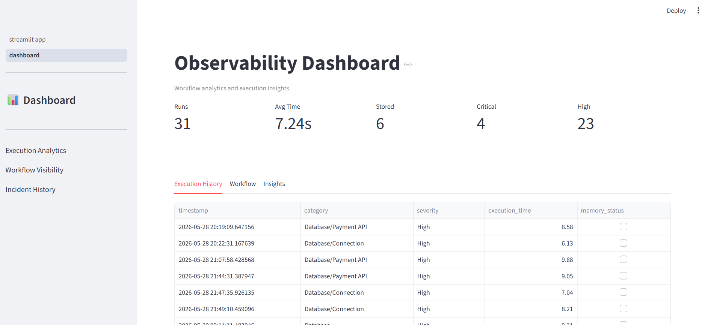
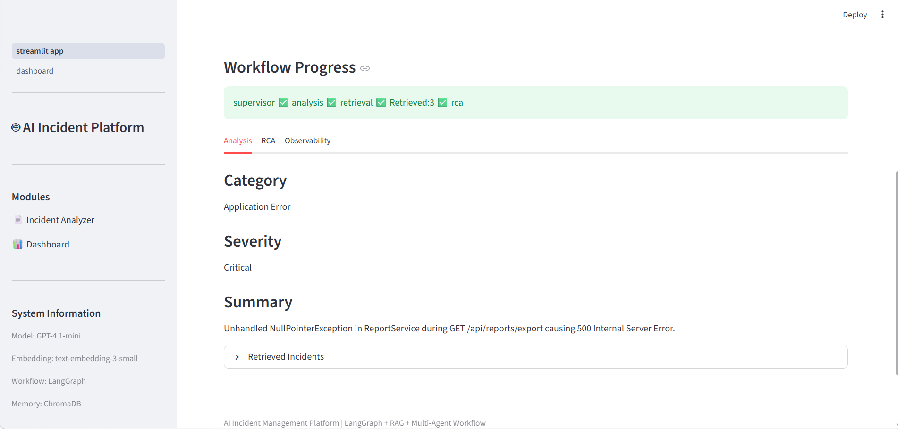
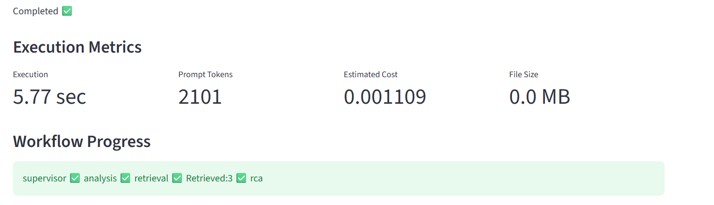

# 🚨 AI Incident Management Platform

An AI-powered Incident Management Platform that automates log analysis, root cause analysis (RCA), incident retrieval, and remediation recommendations using Multi-Agent AI, LangGraph, Retrieval-Augmented Generation (RAG), and Memory.

Supports:

👉 Log Upload & Analysis
👉 Incident Categorization & Severity Detection
👉 Retrieval-Augmented Generation (RAG)
👉 Historical Incident Retrieval using ChromaDB
👉 AI-Generated Root Cause Analysis (RCA)
👉 Auto-Remediation Recommendations
👉 Incident Memory Management
👉 LangGraph Multi-Agent Orchestration
👉 Guardrails & Validation Framework
👉 LangSmith Observability
👉 Streamlit Dashboard + FastAPI Backend
👉 Dockerized Deployment

---

# 📸 Demo Screenshots

### 🖥️ Incident Management Dashboard



### 🔍 Incident Analysis



### 🧠 Root Cause Analysis


### 📊 Observability Dashboard



---

# 📁 Project Structure

```text
ai-incident-management/

├── backend/
│   ├── agents/
│   ├── workflows/
│   ├── tools/
│   ├── guardrails/
│   ├── config/
│   └── data/
│
├── frontend/
│   └── streamlit_app.py
│
├── screenshots/
│
├── docker-compose.yml
├── requirements.txt
├── README.md
├── ARCHITECTURE_DECISIONS.md
└── PROJECT_DOCUMENTATION.md
```

---

# 🚀 Features

* Upload incident log files
* Multi-Agent AI workflow using LangGraph
* Supervisor-based agent orchestration
* Incident categorization
* Severity classification
* Incident summarization
* Historical incident retrieval
* Vector similarity search using ChromaDB
* AI-generated Root Cause Analysis
* Auto-remediation recommendations
* Memory persistence
* Workflow observability
* Token & cost tracking
* Guardrails and validation
* Dockerized deployment

---

# 🏗️ Architecture Overview

```text
Upload Logs
      ↓
Guardrails
      ↓
Supervisor Agent
      ↓
Analysis Agent
      ↓
Retrieval Agent (RAG)
      ↓
RCA Agent
      ↓
Memory Layer
      ↓
Results Dashboard
```

---

# 🤖 Multi-Agent Workflow

## Supervisor Agent

Responsibilities:

* Input validation
* Workflow routing
* Early exit handling

## Analysis Agent

Responsibilities:

* Category detection
* Severity detection
* Incident summarization

## Retrieval Agent

Responsibilities:

* Historical incident retrieval
* Similarity search
* Confidence scoring

## RCA Agent

Responsibilities:

* Root Cause Analysis
* Remediation suggestions
* Confidence generation

---

# 🧠 RAG Architecture

```text
Incident Summary
       ↓
Generate Embedding
       ↓
ChromaDB Search
       ↓
Similarity Retrieval
       ↓
Simple Reranking
       ↓
Context Injection
       ↓
LLM
       ↓
RCA Generation
```

---

# 🛡️ Guardrails

Implemented validations:

* File size validation
* Invalid log detection
* Malicious content detection
* Special character threshold checks
* Log keyword validation
* Workflow protection layer

Examples blocked:

```text
Random Symbols

<script>

powershell

eval()
```

---

# ⚙️ Setup Instructions

## 1. Clone Repository

```bash
git clone https://github.com/Spandit11/ai-incident-management-system
cd ai-incident-management
```

## 2. Create Virtual Environment

```bash
python -m venv venv
```

## 3. Activate Environment

### Windows

```bash
venv\Scripts\activate
```

### Linux / Mac

```bash
source venv/bin/activate
```

## 4. Install Dependencies

```bash
pip install -r requirements.txt
```

## 5. Configure Environment Variables

Create:

```text
.env
```

Add:

```text
OPENAI_API_KEY=

LANGSMITH_API_KEY=

LANGCHAIN_TRACING_V2=true

LANGCHAIN_PROJECT=
```

---

# 💻 Run the Application

## Backend

```bash
uvicorn backend.main:app --reload
```

## Frontend

```bash
streamlit run frontend/streamlit_app.py
```

---

# 🐳 Docker Deployment

Build:

```bash
docker compose build
```

Run:

```bash
docker compose up
```

---

# 🌐 Application URLs

### Streamlit Dashboard

```text
http://localhost:8501
```

### FastAPI Swagger

```text
http://localhost:8000/docs
```

---

# 📊 Observability

The platform tracks:

* Execution time
* Prompt tokens
* Completion tokens
* Estimated cost
* Workflow path
* Memory updates
* LangSmith traces

---

# 🧪 Testing

The following scenarios have been validated:

✅ Valid Incident Logs

✅ SQL Timeout Incidents

✅ API Failures

✅ Large Log Files

✅ Invalid Log Content

✅ Malicious Script Detection

✅ Empty Memory Handling

✅ Historical Incident Retrieval

---

# 📈 Current Version

Version: 1.0

Status: Demo Ready

Implemented:

✅ Multi-Agent Workflow

✅ LangGraph Orchestration

✅ RAG

✅ Memory Management

✅ Guardrails

✅ LangSmith Observability

✅ Docker Support

---

# 🔮 Future Enhancements

## Phase 2

* Multi-Exception Processing
* Chunking & Summarization
* Advanced Reranking
* Incident Correlation

## Phase 3

* Real-Time Log Ingestion
* Alert Integrations
* Monitoring Dashboards
* Multi-Tenant Support

## Phase 4

* Azure Deployment
* Managed Vector Database
* Enterprise Authentication
* CI/CD Pipeline

---

# 👨‍💻 Author

**Sourabh Pandit**

Generative AI • Agentic AI • Azure PaaS • Cloud-Native .NET Solutions

This project was developed as a practical Proof of Concept demonstrating:

* Multi-Agent AI
* LangGraph Orchestration
* Retrieval-Augmented Generation (RAG)
* Memory Management
* Guardrails & Observability
* Production-Inspired Architecture Patterns

### Connect

* LinkedIn: https://www.linkedin.com/in/sourabh-pandit-b2570212
* GitHub: https://github.com/Spandit11/ai-incident-management-system
